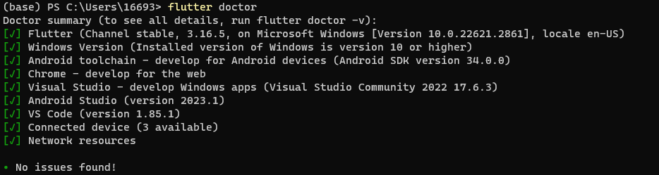

# Installation Guide
## Flutter Get Started

Visit [https://docs.flutter.dev/get-started/install](https://docs.flutter.dev/get-started/install) for detailed instructions.

Follow the steps below to install Flutter on your system:

1. Choose Windows for mobile (later will be set for multi platforms).

2. Follow the instructions for installing a couple of things by visiting the [official installation guide](https://docs.flutter.dev/get-started/install).

   a. Install Flutter through VSCode extensions.

3. Install Flutter SDK using VSCode.

4. Install Android Studio.

5. Test whether everything is installed correctly by running the following commands:

   a. Install Android Studio command-line tools:
      - Open Android Studio.
      - Go to Upper right Settings -> SDK Manager -> SDK Tools Tab.
      - Select Command-Line Tools and install.

   b. Run `flutter doctor` again.

   c. Run the following command to accept all Android licenses:
      ```
      flutter doctor --android-licenses
      ```

   d. Run `flutter doctor` again, and it should show all components successfully installed.



# Test App

You can test your Flutter installation by creating a sample app. Follow the instructions in the [official test drive guide](https://docs.flutter.dev/get-started/test-drive).

If you get error 
```
[test_app] flutter create --template app --overwrite .
Error: Unable to find git in your PATH. 
exit code 1
```

Just run VSCode as administrator before creating test app.